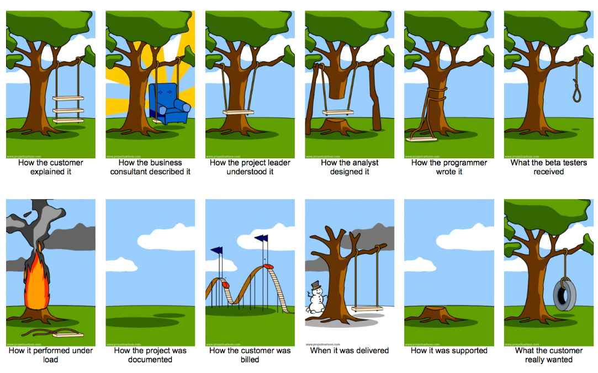

# Первичный анализ задач

К разработке часто приходят с вопросом “помогите, как сделать вот такую задачу?”

В этом кейсе заказчик быстро хочет получить план "на салфетке": реально ли вообще сделать задачу, и насколько она сложна.

Знание технической стороны от разработчика + знание продукта от заказчика = новые решения сложных проблем бизнеса, более быстрые и качественные.

Эти решения развивают продукт быстрее. Заказчики в такие моменты в восторге от разработки. А разработчики проявляют себя как настоящие 10x-инженеры.

## Как разработчик спасает заказчика

Самое главное — осмыслить задачу на стыке технологий и продукта, подойти к бизнес-требованиям творчески:
- Понять, что надо бизнесу на самом деле.
- Подумать, есть ли альтернативные способы решения задачи, кроме разработки того, «что написано».
- Подумать, можно ли отсечь часть требований, радикально упростив задачу.
- Кристаллизовать оптимальный способ технической реализации из бизнес-идеи.

Всё это делается верхнеуровнево и быстро, без погружения в детали, "на салфетке".

### Tips and tricks

- Стоит тесно работать с заказчиком и чётко понимать, какую исходную проблему он хочет решить, и зачем. Так найдутся более простые решения проблем. А порой станет понятно, что надо решать вообще другую проблему. → См. [Формулировка проблем (НЖЯ)](problem-formulation.md)
- Порой видно только дорогое решение (например, cтоит месяц разработки). Тогда можно представить, что у нас гораздо меньше времени (например, неделя). И придумать подходящее решение.
- Есть и другие способы стимулировать творческое мышление. Например, если простое решение мешает придумать особенность работы одного из сервисов — представить, что этой особенности нет.
- Если нужен контекст, который есть у коллеги — стоит его получить.
- Бывает полезен брейншторм не просто одного разработчика с заказчиком, а нескольких разработчиков из одной или разных команд с заказчиком.

## Что не ожидается от помогающего разработчика

- Реакция в течение минут, как в дежурстве. Хороший SLA на реакцию зависит от команды.
Если непонятно, как выбрать SLA - в качестве ориентира можно взять три рабочих дня, а дальше твикать по необходимости. Т.е. можно в спокойном темпе сделать это фоном или между своими задачами. Обычно не нужно всё бросать и заниматься новым запросом на разбор.
- Обнаружение абсолютно всех вариантов, блокеров и деталей задачи.
Нужен верхнеуровневый первичный разбор, что-то не учесть на этом этапе — это ок.
- Точнейшая оценка задачи. Достаточно прикидки на уровне "дни/недели/месяцы".
- Ответ, когда возьмём задачу в работу. С этим лучше отправить заказчика к ответственному за планирование.
- Полная разработка задачи сразу. Достаточно прикинуть верхнеуровневое решение.

## Зачем всё это разработчикам и командам

Во многих компаниях и командах вышеописанной деятельностью занимается только тимлид/техлид. Зачем же делать это не только тимлиду/техлиду, но и другим разработчикам?

- Повышается синергия между разработчиком и продуктом.
Продукт становится тем, на что разработчик напрямую влияет, а не чем-то абстрактным и далёким.
- Разбирать такие вопросы — сложная и очень развивающая активность для разработчиков.
- Контекст сервисов лучше размазывается по команде, повышается bus factor.
- Избавляемся от вечных дежурств по доработкам в фичах.
Например, когда за проект отвечал конкретный разработчик, часто и все вопросы по дальнейшим доработкам проекта прилетают тоже в него. А можно периодически выделять другого разработчика, который разберётся в доработке.
- Повышается вовлечённость команд в будущие задачи: когда разработчик проводил первичный анализ задачи, он лучше понимает её контекст.
После чего, например, может помогать продукту топить за задачу на планировании.
- Убирается бутылочное горлышко в виде тимлида/техлида: избегаем его перегрузки.

## Ограничения салфеточного анализа

- Разработчику нужен helicopter view сервисов команды и её окружения. Без этого помогать будет трудно.
Например, разработчик/команда слишком мало знает о той области, в которой надо решить задачу, и не может быстро получить этот контекст. Тогда стоит просто сказать об этом и поискать коллег в теме. Если таких коллег нет — что ж, похоже, в этой задаче салфеточный анализ неприменим, и нужно дорогое полноценное погружение.
- Бывают настолько сложные задачи, что они никак не решаются салфеточным анализом. Если мы попробовали найти решение быстро и не удалось — не беда. Мы узнали, что даже составить верхнеуровневый план решения — сложная задача сама по себе, это уже ценно. А ещё мы запустили в головах процесс обдумывания, который фоном может внезапно принести решение через недельку-другую :)

## Как не надо делать

1. Отмахнуться от вопроса со словами "у нас огромный беклог, идите ждите месяц, пока мы сможем на это посмотреть".
_Почему это плохо:_ проблема долго не решается, хотя возможно, что на самом деле можно легко найти очень простое решение. Причём порой даже в команде, в которой ресурсы как раз есть.
2. На такие вопросы всегда отвечать только тимлиду/техлиду.
_Почему это плохо:_ ограничивается простор для развития разработчиков, ухудшается принятие решений из-за генерации идей только одним человеком.
3. Уйти прорабатывать или даже сразу программировать решение, не поговорив с заказчиком.
_Почему это плохо:_

